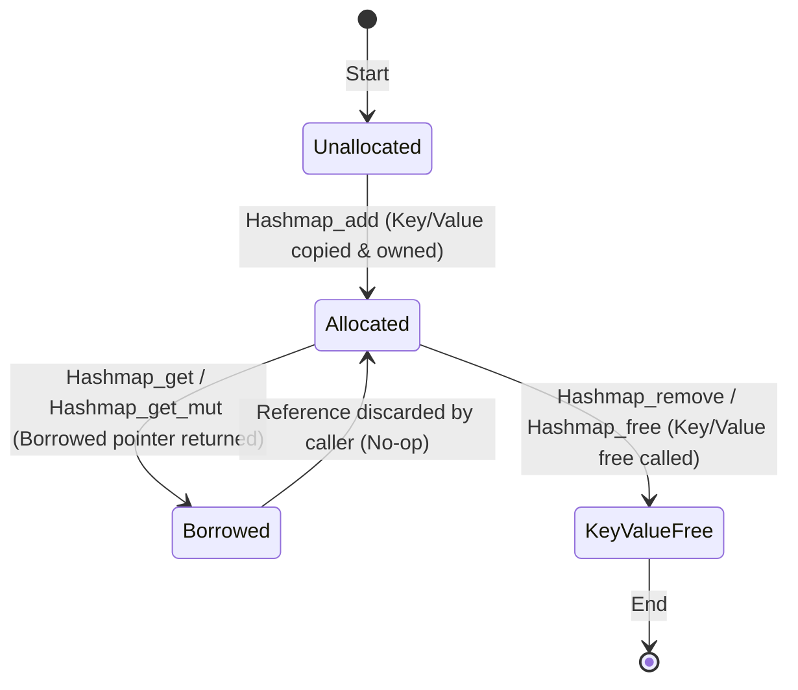

# Ownership And References

This project uses a simple rule:

- Borrowed references are represented by two families: `ref_##Type` for mutable borrows and `cref_##Type` for immutable borrows.
- Neither family owns the underlying data.
- Borrowed helpers remain no-op-compatible so generic code can call `_free` uniformly, but those destructors are intentionally no-ops.
- Containers own the elements stored inside them.
- Functions ending in `_free` destroy owned elements and release container storage.
- Functions ending in `_at` or `_get` return borrowed references into internal storage.
- Functions ending in `_pop` return a value by copy and transfer that copy to the caller.
- Result_Void error messages are borrowed `const char *` values; the helpers do not own or free them.

## Per container

### Vector

- `Vector_##Type##_push_back` copies a value into the vector.
- `Vector_##Type##_at` returns a borrowed value wrapped in `Result_Void_##Type##_ref`; read-only vector APIs should use `cref_##Type`.
- `Vector_##Type##_set` destroys the old element before writing the new one.
- `Vector_##Type##_clear` destroys all owned elements but keeps the allocation.
- `Vector_##Type##_free` destroys all owned elements and frees the allocation.

### Linked list

- `List_##Type##_push_back` copies a value into a node.
- `List_##Type##_pop_back` returns a copy of the stored value.
- Read-only list APIs should use `cref_##Type`.
- `List_##Type##_free` destroys each stored value and frees all nodes.

### Hash map

- `Hashmap_##Key##_##Value##_add` takes ownership of key and value objects.
- `Hashmap_##Key##_##Value##_get` returns a borrowed pointer to the stored value.
- Read-only hash map APIs should use `cref_##Hashmap_##Key##_##Value`.
- `Hashmap_##Key##_##Value##_remove` destroys both key and value.
- `Hashmap_##Key##_##Value##_pop` destroys the key and returns the stored value by copy.
- `Hashmap_##Key##_##Value##_free` destroys every owned key/value pair.

### Iteration contract

- Containers that support iteration expose `into_iter` and `iter_next`.
- `iter_next` returns the next element wrapped in `Result_Void_##Type##_ref` and advances the iterator. When the iterator is exhausted it returns an error result.
- The library provides loop macros and functional iterator operations:
  - `for_each_ref(ContainerType, var_name, iterable)` (exposes a borrowed reference pointer to `ContainerType`'s elements).
  - `for_each(ContainerType, var_name, iterable)` (exposes a copied value of `ContainerType`'s elements).
  - `for_each_fn(ContainerType)(&container, callback)` (iterates using a callback function or lambda).

  For example:
  ```c
  for_each_ref(Vector(Int), item_ref, &vector) {
    printf("%d\n", ref_deref(Int)(item_ref));
  }
  ```

### Result_Void helpers

- `Result_Void_##Type##_ok` stores an owned value.
- `Result_Void_##Type##_err` stores a borrowed error message and does not take ownership of it.
- `Result_Void_##Type##_free` destroys the stored value only on success.

### Struct generation

- `STRUCT_CONFIG(Type, ...)` should be the default rule for new public structs.
- It declares the struct, expands `ref_##Type`, and generates matching `Type_free` and `Type_clone` helpers from the same field list.
- The field list is the source of truth; the free and clone implementations should not be hand-written unless there is a special ownership case.
- Functions that do not mutate their input should prefer `cref_##Type` so borrow mode is obvious at a glance.
- This rule applies to data structs, not to container templates whose lifecycle logic is richer than a simple field-wise expansion.

## Consequence

Because ownership is explicit, nested containers can be composed safely if each nested type exposes a matching destructor.

## Visual Lifecycle Diagrams

### 1. Heap Box Lifecycle (`Box_Type`)

A Box completely owns its single heap-allocated value. Ownership can be extracted (returning the value by copy and freeing the box metadata) or fully destroyed along with the inner value.

```mermaid
sequenceDiagram
    participant C as Caller
    participant B as Box_Type
    participant V as Inner Value

    C->>B: Box_Type_new(value) (Value copied into heap box)
    activate B
    C->>B: Box_Type_deref(&box) (Get borrowed ref_Type)
    B-->>C: ref_Type
    Note over C, B: Mutate or read inner value safely
    
    rect rgb(240, 240, 255)
        Note over C, B: Option A: Extract ownership
        C->>B: Box_Type_into_inner(&box)
        B-->>C: Type (Inner value returned by copy)
        deactivate B
        Note over C: Box metadata is freed
    end

    rect rgb(255, 240, 240)
        Note over C, B: Option B: Destroy Box
        C->>B: Box_Type_free(&box)
        B->V: Type_free(&value) (Inner destructor called)
        deactivate B
    end
```

### 2. Hash Map Entry Lifecycle (`Entry_##Key##_##Value`)

Hash Map entries transition from unallocated to owned, can be borrowed temporarily via references (`get` / `get_mut`), and are ultimately destroyed.


